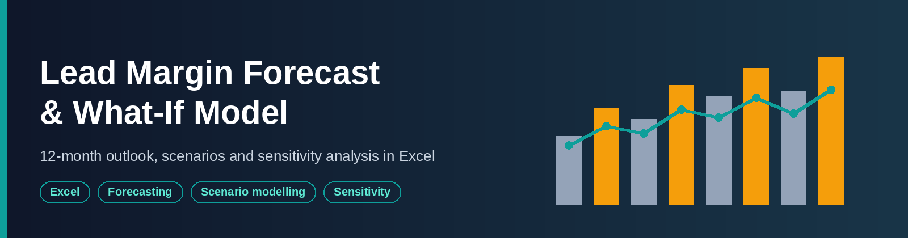
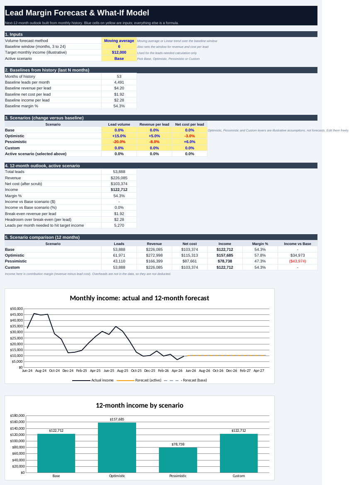

<div align="center">

# Lead Margin Forecast & What-If Model

### A 12-Month Outlook with Scenarios, Sensitivity Grids and a Backtest in Excel


**Pick a method and a scenario, and income, break-even and sensitivity grids update**

</div>

---

## Overview

This project turns 53 months of lead-buying and lead-selling history into a 12-month
outlook, then lets a user test what happens if volume, revenue per lead or lead cost
changes.

Knowing what happened is not enough for planning. The business needs to know what
income to expect if nothing changes, how sensitive income is to prices and volume, and
what revenue per lead is needed just to break even. The model answers these with
transparent formulas, so every assumption sits in its own labelled cell.



## Key Result

> With a 6-month baseline, the **Base** scenario projects about **$122,712 income**
> over the next 12 months. The **Optimistic** scenario reaches **$157,685**, and the
> **Pessimistic** scenario falls to **$78,738**, a spread of about **$79,000** around
> the base case.

| Baseline (last 6 months) | Value |
|---|---|
| Leads per month | 4,491 |
| Revenue per lead | $4.20 |
| Net cost per lead | $1.92 |
| Income per lead | $2.28 |
| Margin | 54.3% |

| 12-month scenario | Lead volume | Revenue per lead | Net cost per lead | Income | Versus Base |
|---|---|---|---|---|---|
| Base | 0% | 0% | 0% | $122,712 | n/a |
| Optimistic | +15% | +5% | -3% | $157,685 | +$34,973 |
| Pessimistic | -20% | -8% | +6% | $78,738 | -$43,974 |

Base outlook: about 53,900 leads, $226,085 revenue and $103,374 net cost. The scenario
percentages are **illustrative assumptions**, not forecasts, and can be edited.

## Main Findings

1. **Income is more sensitive to price than to cost.** Revenue per lead is about twice
   the cost per lead, so a 1% move in revenue per lead shifts income more than a 1%
   move in cost.
2. **The default scenarios are not symmetric.** The Pessimistic case is about $44,000
   below Base and the Optimistic case about $35,000 above, because the pessimistic
   levers are larger. Edit the levers to test your own view.
3. **Break-even is far below current pricing.** Break-even revenue per lead is
   $1.92 against a baseline of $4.20, so there is wide headroom before leads lose money.
4. **Short-term forecasts are unreliable.** Monthly volume is so volatile that backtest
   errors are 60% to 70%, so the model works best as a scenario tool, not a point
   prediction.
5. **The window choice matters.** A long linear-trend window across the 2024 to 2025
   volume decline can project near-zero volume, which is why the default is a 6-month
   moving average.

## Honest Backtest Results

The Backtest sheet forecasts each of the last 12 months using only the months before
it, then compares the forecast with the actual value.

| Method | Error on leads (MAPE) | Error on income (MAPE) |
|---|---|---|
| Moving average | 73% | 62% |
| Linear trend | 66% | 61% |

Linear trend is slightly better on both measures, but neither is accurate. Treat the
12-month outlook as a planning baseline.

## Model Components

| # | Sheet | What it does | Key formulas |
|---|---|---|---|
| 1 | **Model** | Inputs, baselines, scenarios, 12-month outlook, scenario chart | `INDEX`, `MATCH`, `AVERAGE`, `SUM` |
| 2 | **Forecast** | Month-by-month projection and actual-versus-forecast chart | `FORECAST`, `EDATE`, `INDEX:INDEX` windows |
| 3 | **Sensitivity** | Two what-if grids with colour scales | Direct formulas, conditional formatting |
| 4 | **Backtest** | Rolling one-month-ahead test and MAPE | `FORECAST`, `AVERAGE`, `ABS` |
| 5 | **History** | Monthly actuals built from raw data | `SUMIFS` |
| 6 | **Notes** | Method, assumptions, data preparation | n/a |
| 7 | **Data** | Cleaned records as an Excel Table | n/a |

**Inputs you can change** (blue text on yellow cells, Model sheet):

| Input | Options |
|---|---|
| Volume forecast method | Moving average or Linear trend |
| Baseline window | 3 to 24 months |
| Active scenario | Base, Optimistic, Pessimistic, Custom |
| Scenario levers | Change in volume, revenue per lead, net cost per lead |
| Target monthly income | Used for the leads-needed calculation |

## Excel Skills Shown

| Skill | Where it is used |
|---|---|
| Forecasting with `FORECAST` and moving averages | Volume forecast, backtest |
| Dynamic windows with `INDEX:INDEX` | Baselines follow the chosen window |
| Scenario selector with `INDEX` and `MATCH` | Active scenario |
| Two-way sensitivity grids | Sensitivity sheet |
| Conditional formatting colour scales | Sensitivity heatmaps |
| Backtesting and MAPE | Backtest sheet |
| Break-even and target-driven calculations | Model sheet |
| Financial-model conventions | Blue inputs on yellow, black formulas |
| `SUMIFS` over about 10,000 rows | History sheet |

## Dataset

The model uses the same anonymised dataset as the companion project,
[lead-performance-dashboard-excel](https://github.com/sanjibSamadder/lead-performance-dashboard-excel).

| Property | Value |
|---|---|
| Records | 9,796 (partner, offer and month level) |
| Period | January 2022 to May 2026 (53 months) |
| Fields | Month, Year, Lead Type, Partner, Offer, Leads, Gross Cost, Net Cost, Revenue, Income |
| Partners | 77, anonymised as Partner 01 to Partner 77 |

**Data preparation:** one record with a blank revenue was rebuilt as auto revenue plus
agent revenue (this identity held on every other row). One blank offer was labelled
"Unknown". Unused columns were removed. Income equals revenue minus net cost on 100% of
source rows.

## Repository Structure

```
.
├── Lead_Margin_Forecast_WhatIf_Model.xlsx   # The workbook
├── Asset/
│   └── Banner_image/                        # Banner used in this README
├── images/
│   └── model.png                            # Screenshot used in this README
└── README.md
```

## Getting Started

**1. Clone the repository**

```bash
git clone https://github.com/sanjibSamadder/lead-margin-forecast-whatif-excel.git
cd lead-margin-forecast-whatif-excel
```

**2. Open the workbook** in Excel 2010 or later. No macros or add-ins are needed.

**3. On the Model sheet,** change the blue-on-yellow cells: method, window, target,
active scenario and scenario levers. Check **Forecast** for monthly detail,
**Sensitivity** for the grids and **Backtest** for accuracy.

## Limitations

- **No seasonality is modelled.** The history is short and dominated by a structural
  drop in volume, so a seasonal pattern cannot be separated reliably.
- **Backtest errors are large** (about 60% to 70%), because monthly volume is volatile.
- **Scenario levers and the income target are illustrative inputs,** not derived from
  data.
- **Income is contribution margin.** Overheads are not in the data, so they are not
  deducted. Currency is assumed to be USD.
- **A single baseline window drives the forecast.** Results change noticeably when the
  window changes, and a long linear-trend window can project near-zero volume.
- **The workbook was built programmatically and recalculated outside Excel.** Chart
  styling may look slightly different in Excel.

## Provenance & License

**Source:** a monthly extract from a lead-buying and lead-selling business, taken from
the author's past work. Partner names were replaced with Partner 01 to Partner 77 to
protect confidentiality.

**License:** not yet specified. Add a licence file before inviting reuse of the data.

## Future Work

- [ ] Add seasonality using more history or a seasonal index
- [ ] Add a probabilistic view (best, expected and worst range) using Monte Carlo
- [ ] Forecast by partner or offer instead of the whole business
- [ ] Add overhead costs for a full profit view
- [ ] Rebuild the same model in Python and compare the forecast accuracy

## Author

**Sanjib Samadder**

**📬 Let's connect!** I'm open to discussions about data analytics, forecasting, and collaborative projects.

[](mailto:skilled.sanjib@gmail.com)
[](https://github.com/sanjibSamadder)
[](https://www.linkedin.com/in/sanjibsamadder)

**Happy Forecasting!** 📈

## Disclaimer

This project is for educational and portfolio purposes only. Scenario values are
illustrative and the outlook is a planning baseline, not financial advice.
